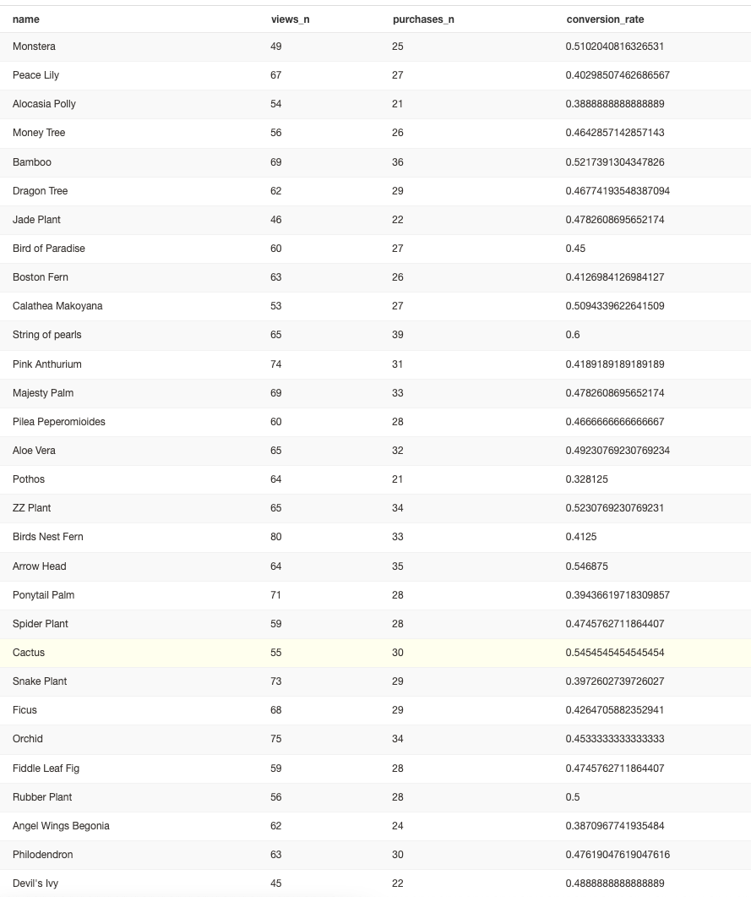

# Answers for Project 3

> What is our overall conversion rate?

```sql
WITH

distinct_sessions AS (
  SELECT DISTINCT session_id, order_placed
  FROM dbt.dbt_daniel_a.fact_session_orders
)

SELECT 
  AVG(order_placed) AS conversion_rate
FROM distinct_sessions
```

**Answer**: 0.84520123839009287926

> What is our conversion rate by product?

```sql
WITH

product_views AS (
  SELECT 
    name
    , COUNT(*) AS views_n
  FROM dbt.dbt_daniel_a.fact_session_orders
  WHERE event_type = 'page_view'
  GROUP BY name
)

, product_purchased AS (
  SELECT 
    name
    , COUNT(*) AS purchases_n
  FROM dbt.dbt_daniel_a.fact_session_orders
  WHERE event_type = 'add_to_cart' AND order_placed = 1
  GROUP BY name
)

SELECT
  product_views.name
  , views_n
  , purchases_n
  , purchases_n::float / views_n::float AS conversion_rate
FROM product_views
LEFT JOIN product_purchased ON product_views.name = product_purchased.name
```
**Answer**: 

